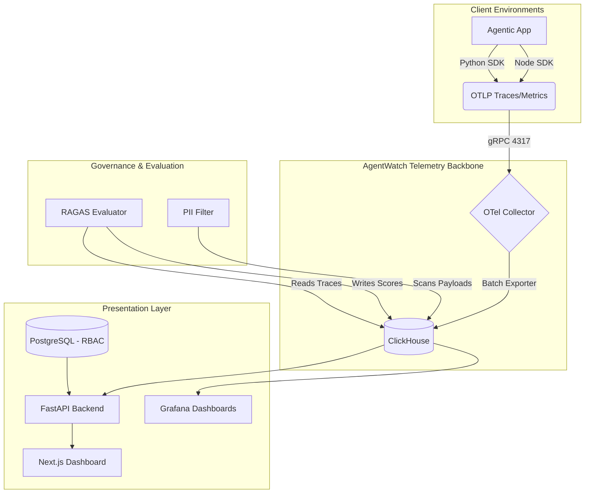

# AgentWatch V2 🛡️
**Enterprise OpenTelemetry AI Agent Observability Platform**

AgentWatch V2 is a production-grade AI Agent Observability and Telemetry Platform completely rebuilt on top of **OpenTelemetry (OTLP)**. It provides deep, standard-compliant tracing, metrics, and logs for complex Multi-Agent systems, Vector Databases, and LLM providers.

---

## 🏗️ V2 Architecture

AgentWatch V2 abandons custom interceptors in favor of native OpenTelemetry instrumentation, ensuring zero vendor lock-in and high-throughput reliability.



1. **OTLP Telemetry Backbone:** An OpenTelemetry Collector (`otel-collector-contrib`) securely ingests traces (gRPC 4317 / HTTP 4318) and handles batching, resource detection, and retries.
2. **Storage Layer:**
   - **ClickHouse:** High-performance columnar database for ultra-fast trace and metrics analytics.
   - **PostgreSQL:** Relational database for Workspace, User, and RBAC metadata.
3. **Backend (FastAPI):** High-performance Python backend responsible for serving trace data to the frontend, enforcing RBAC, and executing asynchronous AI Evaluations (RAGAS/DeepEval).
4. **Frontend Dashboard (Next.js 14):** A React Server Components dashboard for visualizing Trace Hierarchies (Workflow -> Agent -> Tool -> LLM).
5. **Python SDK (`agentwatch`):** An OpenTelemetry wrapper SDK that provides zero-config monkey-patching for major LLM and Vector DB providers, along with semantic decorators.

---

## 🚀 Key Capabilities

### 1. Unified Telemetry Layer
AgentWatch exports standard OTLP Traces, Metrics, and Logs. It natively structures AI execution hierarchies:
`Workflow Span` -> `Agent Span` -> `Tool Span` -> `LLM/DB Span`

### 2. Comprehensive Auto-Instrumentation
The SDK dynamically monkey-patches popular libraries without requiring code changes:
- **OpenAI & Anthropic:** Extracts input/output tokens, models, prompts, and responses.
- **Pinecone (Vector DB):** Traces `Index.query` execution time, `top_k`, and retrieval match counts.
- **Model Context Protocol (MCP):** Native interception of `call_tool` and `read_resource` execution paths.

### 3. Governance & Evaluation
The backend includes isolated workers that evaluate traces directly from ClickHouse:
- **RAGAS Evaluator:** Scores traces for Faithfulness and Answer Relevance.
- **DeepEval Evaluator:** Checks LLM responses against ground truth to detect Hallucinations.
- **PII & Prompt Injection Filters:** Analyzes payloads for SSNs, Credit Cards, and common jailbreak heuristics.

### 4. Enterprise Infrastructure
- **RBAC & Multi-Tenancy:** Hardened API using `HTTPBearer` with strict tenant isolation.
- **Kubernetes Native:** Deploys via K8s Deployments and relies on **KEDA (Kubernetes Event-driven Autoscaling)** to dynamically scale the backend based on Prometheus HTTP request rates.

---

## 🛠️ SDK Usage

### Installation
```bash
pip install agentwatch
```

### Initialization
```python
import time
from agentwatch import init, trace_workflow, trace_agent, trace_tool

# Initialize OTLP Telemetry
telemetry = init({
    "service_name": "research-service",
    "endpoint": "http://localhost:4317"
})
```

### Auto-Instrumentation (Zero-Config)
The SDK will automatically trace supported libraries (OpenAI, Anthropic, Pinecone, MCP) if they are installed.
```python
from agentwatch import instrument_all

instrument_all()
```

### Decorators
Use semantic decorators to construct your trace hierarchy:
```python
@trace_tool(name="search_web")
def search_web(query: str):
    time.sleep(0.5)
    return "Results for " + query

@trace_agent(name="ResearchAgent")
def do_research(topic: str):
    return search_web(topic)

@trace_workflow(name="ContentGenerationWorkflow")
def main():
    do_research("OpenTelemetry in Python")
```

---

## 💻 Local Development Setup

### 1. Prerequisites
- Docker Compose (v2)
- Python 3.10+
- Node.js 18+

### 2. Running the Infrastructure
Start the OpenTelemetry Collector, ClickHouse, and PostgreSQL instances:
```bash
cd docker
docker compose up -d
```

### 3. Running the Dashboard
```bash
cd frontend
npm install
npm run dev
```

### 4. Running the Backend
```bash
cd backend
python -m venv venv
venv\Scripts\activate
pip install -r requirements.txt
uvicorn app.main:app --reload --port 8000
```